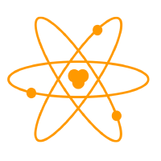

# designs

Neutralinojs design resources for promotions and referencing

## Identity

For referencing and promoting the Neutralinojs framework, please use the following names:

- Neutralinojs (Not NeutralinoJS or NeutralinoJs)
- Neutralino.js (This refers to the client-library, but we would like to use it like Node.js, Electron.js, etc.)
- Neutralino

As a shortname or nickname, we typically call it, Njs or Neu.

Tagline: Portable and lightweight cross platform desktop app development framework
Official website: https://neutralino.js.org

## Logo

- [logo/neutralinojs_logo_200x200.png](logo/neutralinojs_logo_200x200.png)
- [logo/neutralinojs_logo_original.png](logo/neutralinojs_logo_original.png)
- [logo/neutralinojs_logo_vector.svg](logo/neutralinojs_logo_vector.svg)

Logo design credits: [IconsPng](https://www.iconspng.com/image/2688/atom-orange). Copyright free as mentioned in their website. 

## License

[CC0-1.0](LICENSE)

